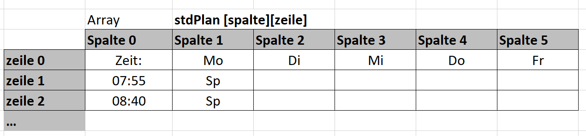
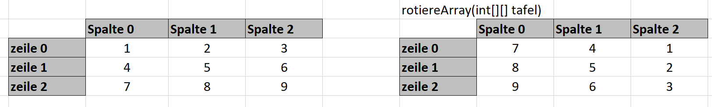

# Zweidimensionale Arrays

## Beschreibung
Mit zweidimenaionalen Arrays, können wir Tabellenähnliche Datenstrukturen in Java abbilden.

## Deklaration
Die Deklaration macht unser Array dem Programm bekannt, so dass wir den Namen verwenden können.
>```String[][] stdPLan;```

## Erstellung des Arrays
Bei der Erstellung mit dem Befehl `new` wird die **unveränderliche** Größe
unseres Arrays festgelegt
>```stdPLan = new String[6][15]```

## Initialisierung des Arrays
Bei der Initialisierung werden an gezielten Positionen Werte in das Array gespeichert. Wir haben hier die Zweite Dimension als Zeile festgelegt. d.h. alle Überschriften unserer Tabelle stehen in **Zeile 0**
 ```java
 stdPlan[0][0] = "Zeit";
 stdPlan[1][0] = "Mo";
 stdPlan[2][0] = "Di";
 ```

## Eine Spalte initialisieren
Die **Spalte 0** ist die **Spalte ganz links** in unserem Array. Wir erinnern uns, das in der ersten Zeileganz links bereits `stdPlan[0][0] = "Zeit";` steht. 

 ```java
 stdPlan[0][1] = "07:55";
 stdPlan[0][2] = "08:40";
 stdPlan[0][3] = "09.25";
 ```
## übergabe von Arrays an eine Methode
In Java wird eine Methode mit `call by reference` übergeben.

```java
public static void ausgabeStdPlan(String[][] plan) {
    //Ausgabe des Arrays
}
```
Das bedeutet, es wird ein Zeiger auf die Stelle im Speicher übegrben,
an der sich das Array befindet.
>Aus diesem Grund kann es sinnvoll sein, eine Kopie eines 
>Arrays zu erstellen, wenn bei der Bearbeitung Fehler auftreten können,
>die das Array beschädigen würden.


## 1 Übung Stundenplan
Erstellen Sie ein Java Programm, welches Ihren Stundenplan in einem zweidimensionalen Array speichert und ausgibt.


### Hauptprogramm
Das Hautpprogramm soll mit Methoden arbeiten.
```java
public static void main(String[] args) {
        String[][] meinPlan = initStdPLan();
        ausgabeStdPlan(meinPlan);
    }
```

## 2 Übung Array rotieren
Erstellen Sie eine Javaklasse `RotiereArray.java` mit folgender **main-Methode**.

```java
public static void main(String[] args) {
        int[][] tafel = initArray();
        ausgabeArray(tafel);
        
        tafel = rotiereArray(tafel);
        ausgabeArray(tafel);
    }
```



- Das Array links soll mit der Methode `initArray()` erzeugt werden.
- Die Methode `ausgabeArray(tafel)` soll das erzeugte Array auf der Konsole ausgeben.
- Die Methode `rotiereArray(tafel)` soll das Array mit dem Namen `tafel` nach rechts um 90° rotieren.